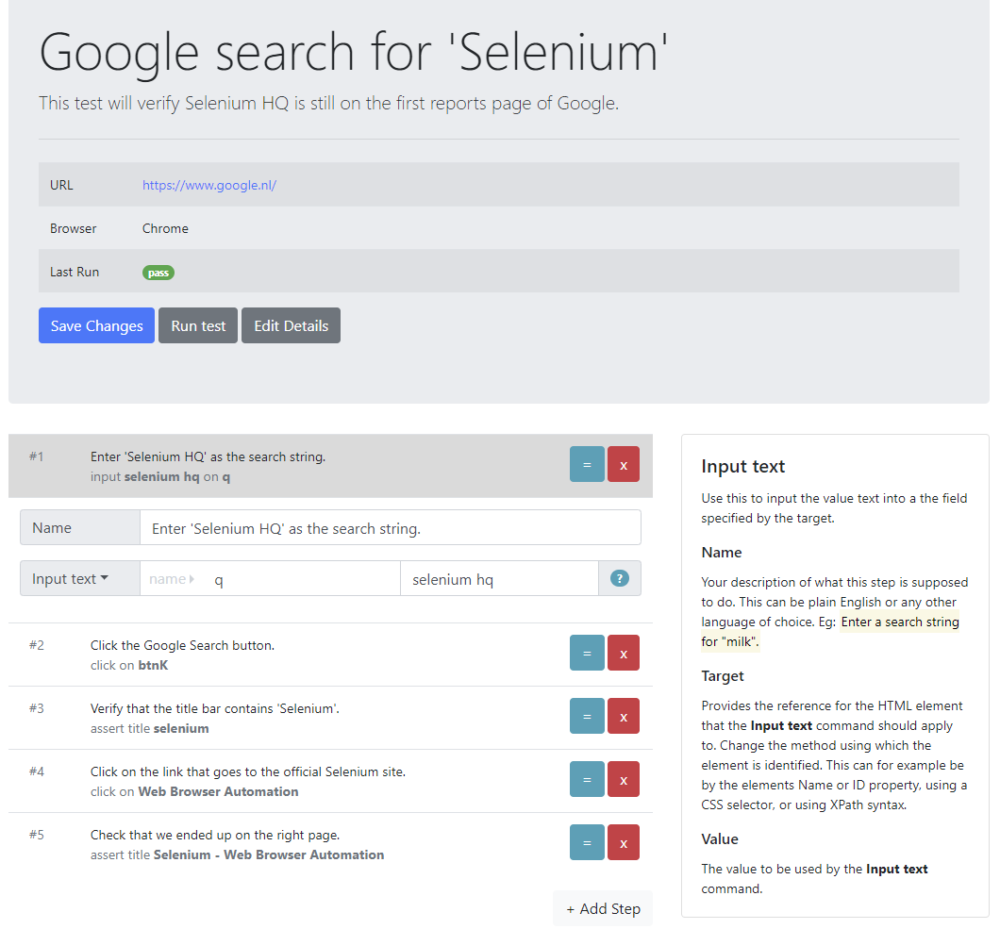
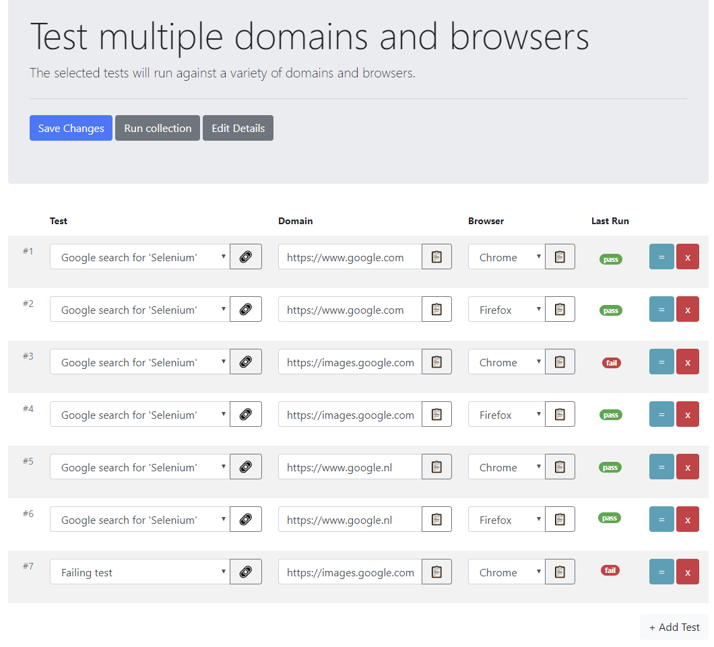

# Uier

Uier (UI[test]er) is a tool that provides codeless or low-code User Experience test editing and management. Uier uses Selenium to perform testing or UI automation. When running a script, results are fed back to the user interface to visually inspect failures. Each step captures screenshots and the full browser state.

Uier tends to be a free self hostable alternative to **Applitools**, **Endtest**, **Ghost Inspector**, **Usetrace**, **Screenster** and many others. In addition to testing, Uier can also be used for general automation purposes.

# Table of contents

* [Tests](#tests)
* [User permissions](#user-permissions)
* [Structure](#structure)
* [API documentation](#api-documentation)
* [Prerequisites](#prerequisites)
* [Installation](#installation)
* [Getting Started](#getting-started)
* [Developer Resources](#developer-resources)

# Tests

To facility testing, Uier implements the Selenium browser automation API. The goal of Uier is to become feature compatible with Selenium IDE by implementing all of its [commands](https://www.seleniumhq.org/selenium-ide/docs/en/api/commands/).

For each test, parameters can be specified such as the starting URL domain and which browser to use. Define the commands that follow the scenario desired to test. Once the test is saved, it can be ran and the results will be output and can be observed for each step.



In addition to running single tests, tests can also be combined in a collection. With a collection, the default parameters can be overwritten. This allows a test to not only run against it's predefine URL domain or browser, but against any desired combination. This is a useful feature to facilitate running the same test against a development environment, a user acceptence environment, a build server, etc.



# User permissions

Uier is set up with multi user support in mind. When first started, an administrator user is automatically created. From there on, the default password ~can~ should be changed. In addition, create extra user accounts for any team members and fine tune their permissions. For instance, users can be granted access to run a test or collection of tests, but be blocked from authoring any.

# Structure

Uier consists out of three individual pilars that communicate with each other through a REST API.

* **client**
  * HTTP client (port 8080)
  * User facing.
* **server**
  * REST API server (port 8081)
  * Uses SQLite as data storage.
  * Facilitates communication between client and runner
* **runner**
  * Selenium backend. 
  * Runs scripts defined by client and reports back status.
  * Needs to run on a Windows environment.

# API documentation

All communication between the Uier front end and the database is routed through a REST API. This REST API is also available for end users to automate common or scheduled events, such as running a test or adding users. The API is documented using Swagger.

* [Uier - Swagger API definition](./documentation/rest-api.yaml)

> Note that as of version 0.3, the API is not final. Any changes made to the database scheme will receive migration scripts to update all data, but the API might change at any time until version 1.0 is reached.

# Prerequisites

* Windows environment (required for Runner browser drivers)
  * Chrome
  * Firefox

# Installation

1. Download latest from GitHub repository.

2. Copy the `settings.example.js` file to `settings.js` and adjust where required.

3. Install all npm dependencies by running the below batch file.

```bash
npm-install.cmd
```

# Upgrading

1. Download latest from GitHub repository.

2. Install all npm dependencies by running the below batch file.

```bash
npm-install.cmd
```

# Getting Started

To run all three services at once, start below batch file. Services can also be started individually.

On first use, log on with email **admin@uier.com** and password **password**. Be sure to change these before start using Uier in a production environment.

```bash
run-all.cmd
```

Individual start commands:
```bash
run-server.cmd
run-client.cmd
run-runner.cms
```

# Developer Resources

* [Selenium webdriver API](https://seleniumhq.github.io/selenium/docs/api/javascript/index.html)
* [Selenium IDE commands](https://www.seleniumhq.org/selenium-ide/docs/en/api/commands/)